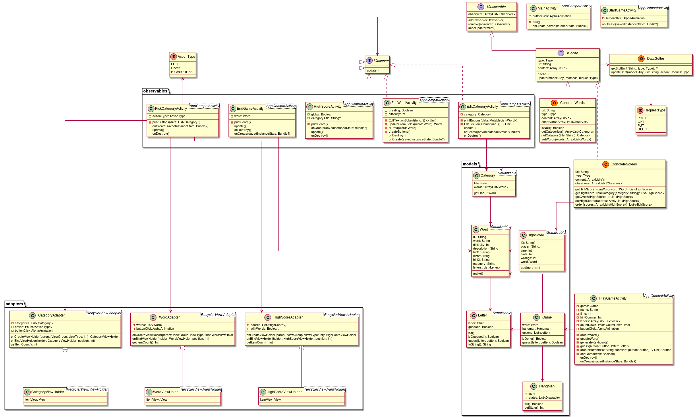

# Hangman App

This is a game where you can pick a category which holds a number of words. The game will shuffle the words and the player will try to guess a hidden word, letter by letter. If the player guesses a letter which does not exist in the word, then a man, will slowly, step by step, be hung by his neck, on the screen.

The app has some flexibility and gives the user a possibility to change, add, and remove words, and categories from a database on which the app is connected to
[using the REST API.](https://github.com/DAT4/android-galgeleg-rest-api)

## Patterns
In the development of the app one key requirement has been to follow software patterns, for me to lean about that.

### MVC
I have chosen to use MVC pattern (Model View Controller), which came naturally to me when I began developing the app, because I worked with this pattern before, and it helped me a lot creating the structure of the game. The MVC pattern is heavily used in the Game Part of the app.

### Observer Pattern
Since I am getting data from the internet, I thought that it will be nice if there was a way to cache the received data on the phone, and share it between Activities, and I was considering using something like a Singleton, or static class. I ended up creating a Kotlin-Object as a **Subject/Observable** and making the Activities who wants to know about the data, **Subscripers/Observers** in their `onCreate()` method, then the observer pattern takes care of updating the views on each active Activity each time the data changes.

### Other patterns
Android development is using a lot of different patterns, like for example the way an Adapter Pattern is used to connect a list of objects to a recycler view, and then do some magic in the background so that the app developer does not have to do it.

## To do

1. Let user pick difficulty
2. High score activity show high scores pr category / word
3. More patterns
4. Make app prettier
    1. Buttons/Keyboard
    2. Learn animations
5. Add statistics words/terms
    1. Dynamic image from description(equations)

